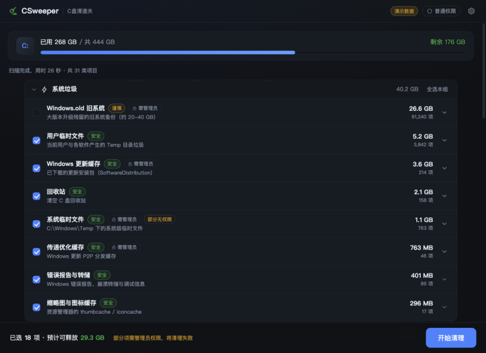

# CSweeper · C盘清道夫

开源的 Windows C 盘清理工具，主打**选择式清理**：先扫描、再勾选、确认后清理，所见即所删。



## 功能特性

- **31 类清理规则**，覆盖 C 盘主要垃圾来源，按 7 个分组展示（系统 / 驱动与显卡 / 浏览器 / 游戏与录屏 / 聊天工具 / 开发者 / 高级系统项）
- **风险三级分类**：`安全`（默认勾选）/ `谨慎`（含个人文件，默认不勾）/ `高级`（系统级操作，默认不勾）
- **预览式清理**：每条规则可展开查看文件清单（按大小排序），点文件夹图标可直接在资源管理器中定位
- **默认进回收站**：通过 Windows Shell API 删除，误删可从回收站还原
- **特殊项目走系统接口**：回收站清空（PowerShell）、WinSxS 清理（DISM `StartComponentCleanup`）、休眠文件（`powercfg /h /type reduced`），不直接硬删系统文件
- **权限感知**：非管理员运行时明确标注"需管理员"的项目，清理失败逐文件给出原因
- **规则即配置**：清理规则集中在 `src-tauri/src/rules.rs`，声明式定义（路径通配 / 扩展名 / 文件年龄 / 排除项），便于增补

### 覆盖的典型"C 盘杀手"

| 分类 | 规则 |
|---|---|
| 游戏录屏 | NVIDIA ShadowPlay / Instant Replay / Xbox Game Bar 视频（Videos 目录，>7 天） |
| 驱动安装包 | `%PROGRAMDATA%\NVIDIA Corporation\Downloader`、`Installer2`、`C:\AMD`、`C:\Intel`、Package Cache |
| 浏览器 | Edge / Chrome / Firefox 缓存；**下载文件夹**（谨慎级，展开确认后清理） |
| 游戏日志 | UE 引擎 `Saved\logs` / `Saved\Crashes`、`CrashDumps`、Steam 日志 |
| 聊天 | 微信 `FileStorage\cache`（不含聊天记录本体） |
| 系统 | Temp、更新缓存、WER 错误报告、缩略图缓存、Minidump、Windows.old、回收站、休眠文件、WinSxS |
| 开发者 | npm / pip / Gradle / NuGet 缓存 |

## 技术栈

- **前端**：React 18 + TypeScript + Vite（无 UI 框架，手写深色主题）
- **后端**：Rust + Tauri 2
- **关键库**：`walkdir`（目录枚举，不跟随 junction 防止死循环/重复统计）、`globset`（规则匹配，大小写不敏感）、`trash`（回收站删除）

## 开发

```bash
npm install

# 浏览器演示模式（无需 Windows，使用模拟数据，界面右上角显示"演示数据"）
npm run dev            # http://localhost:1420

# Windows 真机调试（需要 Rust 与 Node）
npx tauri dev

# 打包发布（Windows 上生成 NSIS 安装包与 exe）
npx tauri build
```

没有 Windows 机器？把仓库推到 GitHub，附带的 workflow 会自动构建（见下）。

## CI 自动构建 Windows 安装包

`.github/workflows/build-windows.yml` 在 push 时触发，在 `windows-latest` 上执行 `npx tauri build`，并把 NSIS 安装包（`*.exe`）上传为 Artifact。Fork / 推送后到 Actions 页面下载即可。

## 使用建议

1. **右键"以管理员身份运行"**——否则系统目录、驱动缓存、WinSxS 等约 1/3 的项目会清理失败（界面会明确提示）
2. 首次使用先展开"谨慎"级项目（下载文件夹、录屏视频）确认清单，再勾选
3. 缩略图缓存被资源管理器占用时会清理失败，属正常现象，重启后可清

## 安全设计

- 删除只针对**文件**，目录结构永不改动（空目录保留，不破坏软件）
- 清理前必须勾选 + 二次确认；默认仅勾选"安全"级
- 永不触碰的目录：`C:\Windows\Installer`、`WinSxS`（只走 DISM 接口）、系统 DLL 等
- 单文件失败不影响其他文件，失败原因逐条记录并展示
- 清理按扫描时同样的规则**重新枚举**（而非缓存列表），避免预览截断导致误删/漏删

## Roadmap

- [ ] 微信 4.x（`xwechat_files`）缓存专项
- [ ] 重复文件检测（参考 Czkawka 三级过滤：大小 → 部分哈希 → 全量哈希）
- [ ] NTFS MFT 直读加速全盘分析（WizTree 路线）
- [ ] 清理历史记录与日志文件
- [ ] 外部规则文件（JSON）+ 规则热更新

## License

MIT
